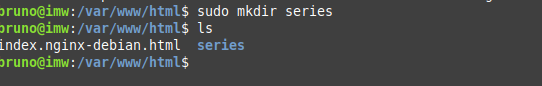

# Mis Series Favoritas

***Nombre:Bruno Amancio González Gorrín***
***Curso:*** 2º de Ciclo Superior de Administración de Sistemas Informáticos en Red.

### ÍNDICE

+ [Introducción](#id1)
+ [Objetivos](#id2)
+ [Material empleado](#id3)
+ [Desarrollo](#id4)
+ [Conclusiones](#id5)

#### ***Introducción***. 

En esta práctica vamos a hacer una página web en la que vamos a mostrar nuestras series favoritas. El objetivo es luego lanzar nuestra página nginx con docker.

#### ***Objetivos***. 

Los objetivos de la prática son los siguientes:

    1-La página debe abrirse al acceder a http://nombre_alumno.me/series/
    2-Poner las portadas de las series, no los nombres.
    3-Los enlaces de las portadas de las series deben ir a su correspondiente página dentro de IMDB
    4-La página hay que editarla directamente en la máquina de producción, accediendo por ssh y utilizando un editor en consola (nano, vi, ...)
    5-Ubicar el index.html en /var/www/html/series/.

#### ***Material empleado***. 

Una máquina Debian sin entorno gráfico. Se usa SSH para acceso remoto.

#### ***Desarrollo***. 

Lo primero que hay que hacer es crear la carpeta series.

Especificamos en sites-available la ruta que se va a usar.

En el index el código es el siguiente, que será el que se encargará de mostrar la página web.

Comprobamos que la página funciona correctamente, poniendo la siguiente ruta en el buscador.

Hecho esto, para lanzar nuestra página con docker, tenemos que hacer un docker compose up para crear la imagen de nuestra página web.

Comprobamos que funciona.

Ahora debería de entrar vía el enlace siguiente.

Tenemos que asegurarnos de añadir en el etc/hosts lo siguiente, de lo contrario no podremos entrar en la página.

La estructura final de los ficheros de nuestra página debe de ser la siguiente, de lo contrario no funcionará.

> ***IMPORTANTE:*** si estamos capturando una terminal no hace falta capturar todo el escritorio y es importante que se vea el nombre de usuario.

Si encontramos dificultades a la hora de realizar algún paso debemos explicar esas dificultades, que pasos hemos seguido para resolverla y los resultados obtenidos.

#### ***Conclusiones***. 

Hemos logrado usar docker para lanzar una página nginx de manera exitosa.