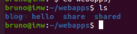
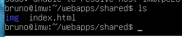

# Listado de directorios

***Nombre:Bruno Amancio González Gorrín***
***Curso:*** 2º de Ciclo Superior de Administración de Sistemas Informáticos en Red.

### ÍNDICE

+ [Introducción](#id1)
+ [Objetivos](#id2)
+ [Material empleado](#id3)
+ [Desarrollo](#id4)
+ [Conclusiones](#id5)

#### ***Introducción***. 

Se va permitir el acceso al contenido de un subdirectorio dentro de Nginx enlazando unos ficheros.

#### ***Objetivos***. 

1-Se debe acceder al listado al entrar en http://nombre_alumno.me/shared/
    El listado debe contener los siguientes ficheros:
        /etc/apt/sources.list (repositorios de paquetes)
        /etc/resolv.conf (listado de DNS)
        /etc/bash.bashrc (configuración global de bash)
        /proc/cpuinfo (características de la máquina)

#### ***Material empleado***. 

Una máquina Debian a la que se accede mediante SSH.

#### ***Desarrollo***. 

Creamos en la carpeta de webapps la carpeta shared.

Y dentro de shared movemos la práctica anterior con el comando cp.

> ***IMPORTANTE:*** si estamos capturando una terminal no hace falta capturar todo el escritorio y es importante que se vea el nombre de usuario.

Si encontramos dificultades a la hora de realizar algún paso debemos explicar esas dificultades, que pasos hemos seguido para resolverla y los resultados obtenidos.

#### ***Conclusiones***. 

Hemos aprendido a enlazar ficheros usando Nginx y Docker.