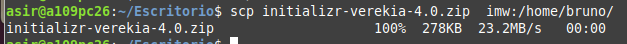

# TRABAJO CON VIRTUAL HOSTS

***Nombre:Bruno Amancio González Gorrín***
***Curso:*** 2º de Ciclo Superior de Administración de Sistemas Informáticos en Red.

### ÍNDICE

+ [Introducción](#id1)
+ [Objetivos](#id2)
+ [Material empleado](#id3)
+ [Desarrollo](#id4)
+ [Conclusiones](#id5)

#### ***Introducción***. 

El objetivo de la práctica es crear 4 webs en nuestro servidor de Nginx. Para esto se nos dan los siguientes objetivos.

#### ***Objetivos***. 

Los objetivos a cumplir son los siguientes:

    +Acceder mediante http://imw.nombre_alumno.me
        Debe mostrar una página con la imagen del "Diagrama de unidades de trabajo" de IMW"
    
    -La imagen no debe ser enlazada en remoto, sino  que se debe descargar al directorio de trabajo en la máquina de producción, y luego usar un tag  apuntando a la ruta local.

    +Acceder mediante http://imw.nombre_alumno.me/mec/
        No utilizar un location.
        Debe mostrar una página con un enlace al Real decreto del título de Administración de Sistemas Informáticos en Red - MEC (ver moodle de la asignatura).

    +Acceder mediante http://varlib.nombre_alumno.me:9000
    Debe mostrar el listado de ficheros y directorios de /var/lib de la máquina de producción.
    Pensar qué root definir para conseguir el objetivo planteado.

    +Acceder mediante https://ssl.nombre_alumno.me/students/ (ojo, es https!)
    Debe pedir usuario/clave. Los datos son:
        USUARIO: usuario1
        CLAVE: 2asir
    Debe mostrar una página web con el nombre de todo el alumnado de clase.
    Se debe prohibir explícitamente el acceso al fichero htpasswd

    +Acceder mediante http://redirect.nombre_alumno.me

    Se debe redirigir cualquier petición de este dominio a http://target.aluXXXX.me
        http://redirect.nombre_alumno.me/test/ -> http://target.nombre_alumno.me
        http://redirect.nombre_alumno.me/probando/ -> http://target.nombre_alumno.me
        http://redirect.nombre_alumno.me/hola/ -> http://target.nombre_alumno.me
        ...

    Al acceder a http://target.nombre_alumno.me se debe mostrar la página web que se adjunta en el archivo initializr-verekia-4.0.zip.
        Para copiar y descomprimir el fichero initializr.zip se recomienda usar alguna de las siguientes herramientas: curl, wget, scp, unzip.

    Los logfiles deben ser:
        /var/log/nginx/redirect/access.log
        /var/log/nginx/redirect/error.log

#### ***Material empleado***. 

En esta práctica se usa una máquina virtual con entorno de terminal, a la que accedemos mediante ssh.

#### ***Desarrollo***. 

Para la primera web tenemos que crear una nueva carpeta en webapps, donde guardaremos todo lo relacionado con nuestra página (index y la foto).
En la carpeta /nginx/sites-available tenemos que crear un archivo, en este caso imw.bruno.me y dentro ponemos lo siguiente.

Tenemos que conseguir la imagen.

Despueś de hacer esto hacemos el enlace simbólico hacia la carpeta sites-enabled.

Nuestro index queda de la siguiente manera.

Nuestra página quedaría de la siguiente manera, después de finalizar lo anterior.

Pasamos a la segunda página web. En este caso tendremos que generar una página que nos rediriga a un enlace del BOE sobre el CFGS ASIR.
Nuestro index quedaría de la siguiente manera.

Si entramos mediante la dirección imw.bruno.me/mec, llegamos a los siugiente.

En la tercera página web tenemos que generar una página que nos muestre una lista de ficheros del directorio 
/var/lib. El archivo de Nginx que creamos es el siguiente.

El resultado es el siguiente.

Como se puede ver, hemos accedido mediante el puerto 9000 (:9000). Para especificar un puerto en concreto tenemos que añadir lo siguiente en nuestro archivo de Nginx.

La siguiente página nos requiere que se nos pregunte contraseña y usuario al entrar.
El archivo que generamos en Nginx es el siguiente.

El index es este. Generamos un listado de alumnos.

Intentamos acceder.

Es importante haber editado el archivo htpasswd, y cifrar la contraseña, de lo contrario no funcionará.
Vemos que podemos entrar.

Cambiamos los permisos de htpasswd para que nadie pueda acceder a él, o editarlo. Solo el usuario root.

La última web se basa en una redireccionadora a otra web llamada target.bruno.me. Primero nos descargamos la página objetivo, que será la que se alojará en target. La pasamos por ssh de la máquina local a la remota de la siguiente manera.

El archivo Nginx para redireccionar es este.

Y el target este.

El directorio Webapps queda de la siguiente manera.

Entramos y podremos ver que nos redirige correctamente.

Y entramos correctamente.

Si intentamos acceder con una ruta alterna a la original, como en la primera página web, nos redirige de la misma manera.

> ***IMPORTANTE:*** si estamos capturando una terminal no hace falta capturar todo el escritorio y es importante que se vea el nombre de usuario.

Si encontramos dificultades a la hora de realizar algún paso debemos explicar esas dificultades, que pasos hemos seguido para resolverla y los resultados obtenidos.

#### ***Conclusiones***. 

Hemos logrado profundizar en las funcionalidades de Nginx, pudiendo crear directorios de ficheros, redireccionamientos, etc.