

# WORDPRESS

***Nombre: Bruno Amancio González Gorrín***
***Curso:*** 2º de Ciclo Superior de Administración de Sistemas Informáticos en Red.

### ÍNDICE

+ [Introducción](#id1)
+ [Objetivos](#id2)
+ [Material empleado](#id3)
+ [Desarrollo](#id4)
+ [Conclusiones](#id5)

#### ***Introducción***. 

Vamos a instalar Wordpress y a alojar una página web en este servicio.

#### ***Objetivos***. 

- Descargar Wordpress.
- Instalar el servicio.
- Configurarlo.
- Alojar una web. 

#### ***Material empleado***. 

- Una MV Debian.
- Una MV Ubuntu, donde probaremos el resultado final y configuraremos Wordpress.

#### ***Desarrollo***. 

Vamos a comenzar descargando en nuestra máquina de desarrollo la última versión de Wordpress usando un curl.

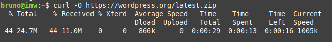

Copiamos la carpeta descomprimida de wordpress a la ruta siguiente.

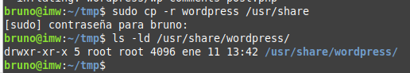

Vamos a modificar el siguiente fichero para que concuerde con nuestra base de datos que hemos creado y el usuario, además de su contraseña, para acceder a la base de datos.

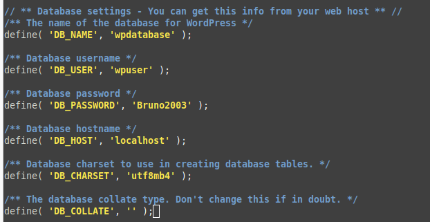

Ahora vamos a crear el archivo de configuración, tal y como se hace a la hora de crear un virtual host.

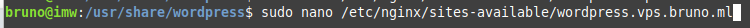

El contenido del archivo es el siguiente.

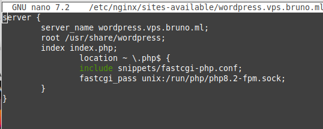

Hacemos un enlace simbólico de este archivo para que nos aparezca en sites-enabled.

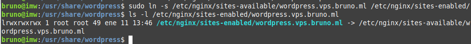

Si ahora intentamos entrar en nuestra página, podremos ver que nos recibe la pantalla del asistente de instalación de Wordpress.

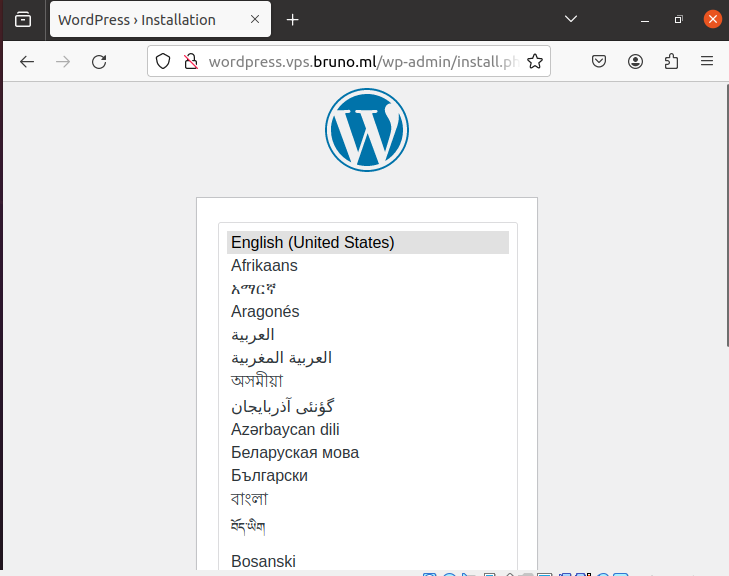

Elegimos idioma y nos recibe la pantalla de creación de usuario y su contraseña. Creamos un usuario, de la siguiente manera. 

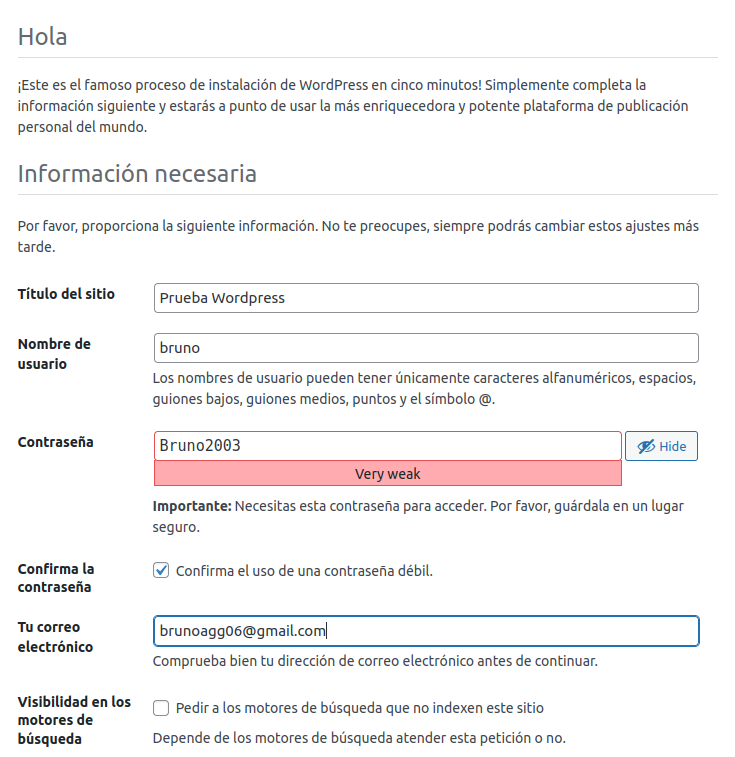

Hemos hecho la instalación. Por tanto, vamos a loguearnos usando las credenciales que hemos creado.

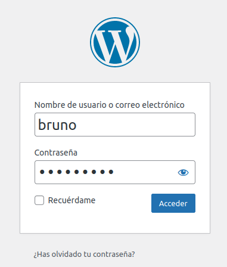

Vamos a ajustar los enlaces permanentes a día y nombre. Lo hacemos usando las herramientas.

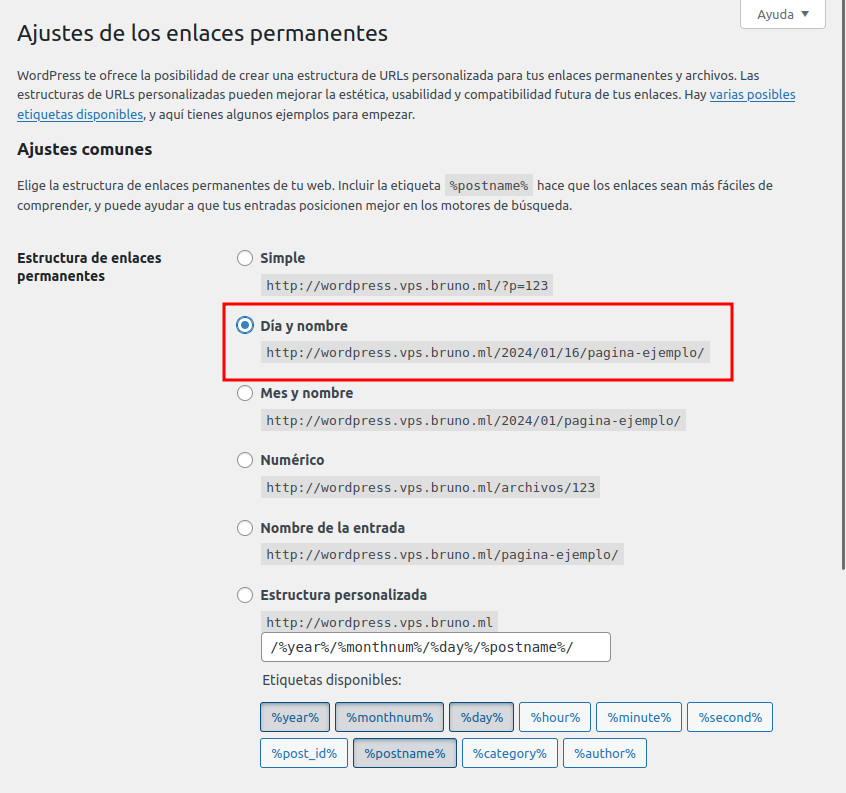

Vemos que usando esto, en el enlace nos aparece el nombre y el día de la página.
Hemos creado un enlace permanente. Ahora vamos a editar el fichero de configuración para que Nginx procese esta URL.
Lo hacemos añadiendo lo siguiente.

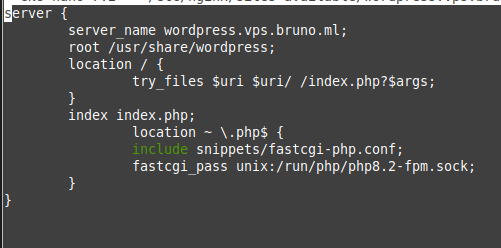

Ahora vamos a editar los límites de subida de archivos, editanto el fichero php.ini. 
Buscamos lo siguiente y le añadimos los siguientes valores.

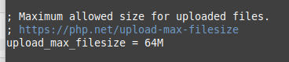

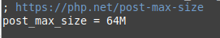

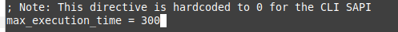

Ahora editamos el archivo Nginx.conf y añadimos lo siguiente.

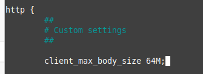

Hacemos un tree en el directorio wp-content para ver los archivos que contiene esta carpeta.

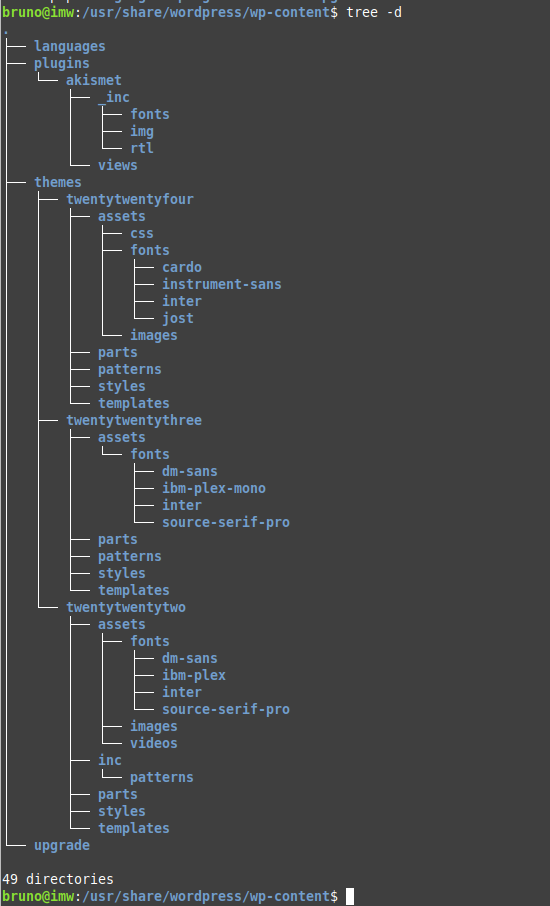

Lo último que tendríamos que hacer sería el crear una página web que contenga lo incluido en el principio de la práctica, las estadísticas de Wordpress. Lo hacemos usando la interfaz de Wordpress.

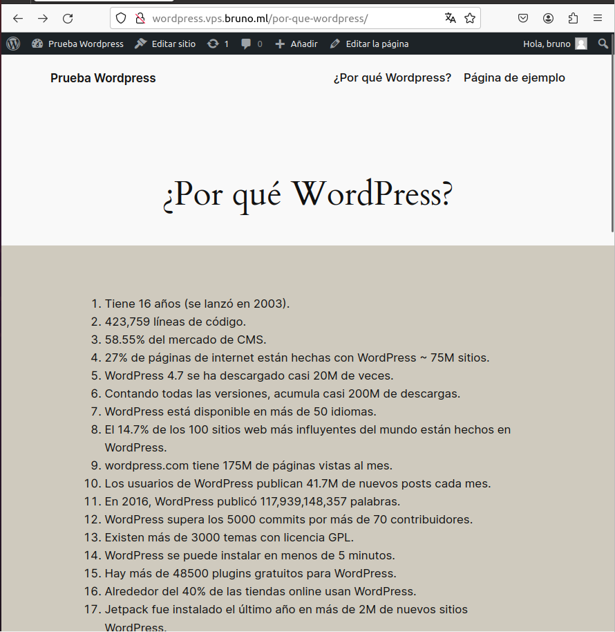

IMPORTANTE: El nombre del archivo Nginx se cambió a wordpress.bruno.me al finalizar la práctica a petición del profesor.

#### ***Conclusiones***. 

En esta parte debemos exponer las conclusiones que sacamos del desarrollo de la prácica.
